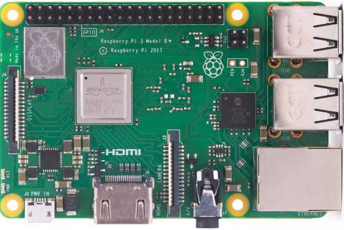
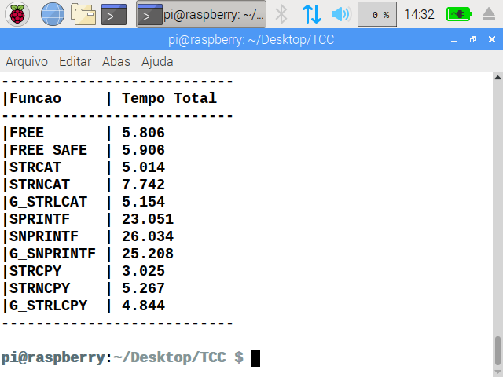

     

# Análise de Buffer Overflow na linguagem C

O presente repositório pertence ao trabalho de conclusão de curso (TCC), tendo a finalidade de apenas disponibilizar o código da linguagem C usado. 

O TCC desenvolvido tem o objetivo de comparar o desempenho das funções confiáveis ao Buffer Overflow com as funções não-confiáveis para medir uma eventual sobrecarga (ou overhead). As funções selecionadas manipulam as strings, apesar de ser uma amostra pequena, tem fins didáticos, visto que há outras funções vulneráveis Buffer Overflow.

O quadro abaixo, descreve  funções com risco de Buffer Overflow na linguagem C.

| Risco Extremo | Risco Alto    | Risco Médio | Risco Baixo |
| ------------- | ------------- | ----------- | ----------- |
| gets()        | strcpy()      | getchar()   | fgets()     |
|               | strcat()      | fgetc()     | memcpy()    |
|               | sprintf()     | getc()      | snprintf()  |
|               | scanf()       | read()      | strccpy()   |
|               | sscanf()      | bcopy()     | strcadd()   |
|               | fscanf()      |             | strncpy()   |
|               | vfscanf()     |             | strncat()   |
|               | vsscanf()     |             | vsnprintf() |
|               | streadd()     |             |             |
|               | strecpy()     |             |             |
|               | strtrns()     |             |             |
|               | realpath()    |             |             |
|               | syslog()      |             |             |
|               | getenv()      |             |             |
|               | getopt()      |             |             |
|               | getopt_long() |             |             |
|               | getpass()     |             |             |

> Fonte:  VIEGA, J.; MCGRAW, G. R. *Building secure software: how to avoid security problems the right way*. [S.l.]: Pearson Education, 2001.
>

# Funções não-confiáveis

As funções `strcat()`, `strcpy()` e `sprintf()` realizam manipulação de strings, segundo o quadro mencionando, apresentam alto risco de ocasionar BOF, pois os limites de memórias não podem ser conferidos. Ademais não há implementação em nível de código capaz de corrigir o estouro do buffer. O desenvolvedor deve estar ciente do risco e evitar o uso destas chamadas, usando versões homólogas, capazes de verificar os limites de memória, como o `strncat()`, `strncpy()` e `snprintf()` ou utilizar outras implementações de bibliotecas confiáveis. 

## strcat()

```c
char *strcat (char *destino, const char *origem)
```

Para concatenar strings, `strcat()` acrescenta uma cópia da string origem na string destino, o caractere de terminação nula da string destino é sobrescrita pelo primeiro caractere da string origem, e depois é adicionado caractere nulo no final da string resultante da concatenação, a string origem se mantém inalterada na execução. Não é possível limitar o tamanho da entrada da string origem na string destino, e poderá acontecer BOF.

## strcpy()

```c
char *strcpy (char *destino, const char *origem )
```

`strcpy()` copia a string origem na string destino (inclusive o caractere de terminação nula da string origem, pois a cópia somente encerra ao encontrá-lo). Para evitar o BOF o tamanho da string destino precisa ser maior do que a string origem com caractere de terminação nula. 

## sprintf()

```c
int sprintf (char *destino, const char *format, ...)
```

A string é gravada no formato de `printf()` pela `sprintf()`, o resultado é armazenado na string destino, a terminação nula é automaticamente anexado no final, a chamada retorna valor inteiro informando a quantidade de caracteres armazenados na string destino. Não é possível delimitar o conteúdo da string resultante, e eventualmente ocorrerá BOF, para evitá-lo, o tamanho da string destino precisa ser grande o suficiente para conter a string resultante.  

# Funções confiáveis nativa do C

As soluções `strncat()`, `strncpy()` e `snprintf()` são mais confiáveis do que seus equivalentes mencionados anteriormente, pois são capazes de limitar a entrada de dados e evitar o BOF, entretanto, continuam sendo vulneráveis, mas apresentando risco baixo. Usar estas funções por si só não garante a confiabilidade, pois é preciso inserir valor válido e solucionar a ausência do terminador nulo em certas ocasiões.

## strncat()

```c
char *strncat (char *destino, const char *origem, size_t tamanho)
```

A função `strncat()` é análoga ao `strcat()`, com adição de limite de caracteres a ser concatenado, representado pelo parâmetro tamanho. O valor válido de tamanho é obtida com `sizeof()` (obtém o tamanho máximo) e depois subtrair o com `strlen()` (que medirá o espaço já preenchido antes da concatenação) e por último subtrair uma unidade para armazenar o terminador nulo. É importante que a string destino tenha o terminador nulo `'\0'`, para evitar lixo de memória (ou garantir que o conteúdo já armazenado tenha o terminador nulo); 

```c
#include <stdio.h>
#include <stdlib.h>
#include <string.h>

int main(void) {
	char destino[6] = "\0", origem[32] = "TESTE BUFFER OVERFLOW";
	int tamanho = sizeof(destino) - 1;
	
	strncat(destino, origem, tamanho - strlen(destino));
	printf("%s", destino);
	
	return EXIT_SUCCESS;
}
```

## strncpy()

```c
char *strncpy (char *destino, const char *origem, size_t tamanho)
```

`strncpy()` substitui `strcpy()`, acrescentando limite de caracteres a ser copiado representado pelo parâmetro tamanho. `strncpy()` copia os primeiros caracteres da string origem até encontrar o primeiro terminador nulo `'\0'`, o restante da string de destino será preenchido com terminador nulo `'\0'`. Caso a string origem for maior do que a string destino, o terminador nulo `'\0'` não será inserido no final. Para obter o valor válido do parâmetro tamanho é recomendado utilizar `sizeof()` sobre a string destino e subtrair uma unidade para gravar o terminador nulo no final. 

```c
#include <stdio.h>
#include <stdlib.h>
#include <string.h>

int main(void) {
	char destino[6] = "\0", origem[32] = "TESTE BUFFER OVERFLOW";
	int tamanho = sizeof(destino) - 1;
    
	strncpy(destino, origem, tamanho);
	destino[tamanho] = ’\0’;	/* Garantir o terminador nulo */
	printf("%s", destino);
    
	return EXIT_SUCCESS;
}
```

## snprintf()

```c
int snprintf (char *destino, size_t tamanho, const char *format, ...)
```

`snprintf()` equivale ao `sprintf()`, com limite de caracteres a ser armazenada pelo parâmetro tamanho. É sugerido obter o valor do parâmetro tamanho usando `sizeof()` sobre a string destino e subtrair uma unidade para alocar o terminador nulo `'\0'` na última posição, que é adicionado automaticamente.

```c
#include <stdio.h>
#include <stdlib.h>
#include <string.h>

int main(void) {
	char destino[6], origem[32] = "TESTE BUFFER OVERFLOW";
	int tamanho = sizeof(destino) - 1;
	
	snprintf(destino, tamanho, "%s%s", origem, origem);
	printf("%s", destino);
	
	return EXIT_SUCCESS;
}
```

# Funções confiáveis da biblioteca `glib.h`

A biblioteca `glib.h` disponibiliza alternativas confiáveis de `strcat()`, `strcpy()` e `sprintf()` que respectivamente são substituídas por `g_strlcat()`, `g_strlcpy()` e `g_snprintf()`. Gnome renomeou os tipos primitivos da linguagem C para evidenciar a presença da biblioteca `glib.h`, adicionando um “g” no início das palavras reservadas, por exemplo, o tipo `int` se torna `gint`, o tipo char se torna `gchar`, o processo se repete aos demais. 

## g_strlcat()

```c
gsize g_strlcat (gchar *destino, const gchar *origem, gsize tamanho)
```

`g_strlcat()` é análogo ao `strncat()`, anexa o terminador nulo no final da string destino, e o parâmetro tamanho, diferentemente de strncat(), é o tamanho total do destino, e não o espaço restante.

```c
#include <stdio.h>
#include <stdlib.h>
#include <string.h>
#include <glib.h>
#include <glib/gprintf.h>

int main(void) {
	char destino[6] = "\0", origem[6] = "TESTE";
	int tamanho = sizeof(destino);
	
	g_strlcat(destino, origem, tamanho);    
	printf("%s", destino);
	
	return EXIT_SUCCESS;
}
```

##  g_strlcpy()

```c
gsize g_strlcpy (gchar *destino, const gchar *origem, gsize tamanho)
```

A opção confiável de `strcpy()` apresentado pela biblioteca `glib.h` é `g_strlcpy()`, a cópia da string origem na string destino tem o terminador nulo acrescentado, o parâmetro tamanho, que recebe `sizeof()` com uma unidade decrementada diretamente para comportar o terminador nulo, ao contrário de `strncpy()`, não preenche a memória livre com o terminador nulo.

```c
#include <stdio.h>
#include <stdlib.h>
#include <string.h>
#include <glib.h>
#include <glib/gprintf.h>

int main(void) {
	char destino[6] = "\0", origem[6] = "TESTE";
	int tamanho = sizeof(destino);

	g_strlcpy(destino, origem, tamanho);
	printf("%s", destino);

	return EXIT_SUCCESS;
}
```

##  g_snprintf()

```c
gint g_snprintf (gchar *destino, gulong tamanho, gchar const *format, ...)
```

`g_snprintf()` é a alternativa confiável do `sprintf()`, a saída produzida pela função não ultrapassará a quantidade de caracteres representado pelo parâmetro tamanho que recebe `sizeof()` com uma unidade já decrementa para alocar o terminador nulo.

```c
#include <stdio.h>
#include <stdlib.h>
#include <string.h>
#include <glib.h>
#include <glib/gprintf.h>

int main(void) {
	char destino[6] = "\0", origem[6] = "TESTE";
	int tamanho = sizeof(destino);

	g_snprintf(destino, tamanho, %s%s, origem, origem);
	printf("%s", destino);

	return EXIT_SUCCESS;
}
```

# Double Free

Double Free é resultado de comportamento indefinido ao usar `free()` em um espaço liberado ou utilizar o valor após seu uso sem atribuir o terminador nulo. A vulnerabilidade é neutralizada ao adicionar uma etapa de verificação do ponteiro, ou, após uso de `free()`, fazer com que o ponteiro receba valor `NULL` imediatamente.

```c
#include <stdlib.h>

int main(void) {
	int *x = malloc(8);
	free(x);
	x = NULL; //Aterramento do ponteiro
	return EXIT_SUCCESS;
}
```

# Equipamento utilizado

O equipamento utilizado foi Raspberry Pi, um computador desenvolvido pela Raspberry Pi Foundation, que é uma organização de caridade britânica. O propósito do hardware é estimular a educação da Ciência Computação através da acessibilidade de aquisição, com valor estabelecido de $35,00, que apesar de apresentar uma configuração modesta, é uma ferramenta capaz de executar diversas tarefas. O modelo específico é [Raspberry Pi 3 model B+](https://www.raspberrypi.org/products/raspberry-pi-3-model-b-plus/), disponibilizado em 2018. O sistema operacional escolhido foi [Raspbian ARM64](https://www.raspberrypi.org/downloads/raspbian/)



# Execução

Dependendo da configuração da distribuição Linux utilizada, é necessário instalar manualmente o `gcc` `make` `pkg-config` e a biblioteca `glib.h`. Mas primeiramente acione o seguinte comando no terminal: `sudo apt-get install libglib2.0-dev`, caso haja alguma complicação, utilize os seguintes comandos abaixo.

```shell
sudo apt-get update
sudo apt-get install gcc
sudo apt-get install make
sudo apt-get install pkg-config
sudo apt-get install libglib2.0-dev
sudo apt-get install libgtk2.0-dev
sudo apt-get install glade
sudo apt-get install glib-2.0
```

O código avaliado foi compilado pelo [GCC 6.3.0](https://gcc.gnu.org/), usando o comando:

```shell
gcc main.c `pkg-config --cflags --libs glib-2.0` -o main -lm
```

Onde ```    `pkg-config --cflags --libs glib-2.0`    ``` representa a biblioteca `glib.h` e ```-lm``` significa a biblioteca `math.h`. Atenção, caso haja problemas na compilação, consulte este [link](https://developer.gnome.org/glib/stable/glib-compiling.html). **Não confundam \` (crase) com ´ (acentuação) ou ' (apóstrofo)**.

# Print execução



# Licença

Este projeto está sob licença [MIT](https://choosealicense.com/licenses/mit/) © 2019 Vitor de Siqueira Cotta. 

Para mais informações acesse o arquivo :scroll:LICENSE.md.

# Contato

:email: E-Mail: ​[vitorsiqueira95@outlook.com](vitorsiqueira95@outlook.com) 

:clipboard: Linkedin: ​[https://www.linkedin.com/in/vitor-de-siqueira-cotta-analista-de-sistemas/](https://www.linkedin.com/in/vitor-de-siqueira-cotta-analista-de-sistemas/)

:package: GitHub:  https://github.com/VitorDeSiqueiraCotta
